# hai ≡ Hacker AI

[](https://crates.io/crates/hai-cli)
[](https://crates.io/crates/hai-cli)

[](https://discord.gg/2nzb4PSAWT)

A CLI (`hai`) with a REPL for hackers using LLMs.


## Documentation

Documentation is available at [braincore.github.io/hai-cli](https://braincore.github.io/hai-cli/)

Or, you can dive in and rely on `hai -h` (CLI), `/help` (REPL), and
`/task hai/help` (LLM helper within REPL).

## Highlights

- ⚡️ Starts in 30ms (on my machine).
- 📦 Single, standalone binary—no installation or dependencies required.
- 🪶 Lightweight (< 9MB compressed) for your machine, SBCs, and servers.
- 🗯 Run many instances for simultaneous conversations.
- 🤖 Supports AIs from OpenAI, Anthropic, DeepSeek, Google, xAI, and
  llama.cpp/Ollama (local) all in a single conversation.
- 🕶 Go incognito `hai -i`.
- ⚙ Give AI the power to run programs on your computer.
- 🍝 Share AI prompt-pasta publicly using the task repository.
- 📂 Load images, code, or text into the conversation.
- 🔗 Load URLs with automatic article extraction and markdown conversion.
- 🎨 Highlights syntax for markdown and code snippets.
- 🖼 Render output to browser.
- 💾 Auto-saves last conversation for easy resumption.
- ☁ Store and share data on the cloud for easy access by AIs.
- 📧 Get emails from AI—send notifications or share data.
- 🛠 Open source: Apache License 2.0
- 💻 Supports Linux and macOS. Windows needs testing (help!).

## Installation

### Installer [Linux, macOS]

```
curl -LsSf https://hai.dog/hai-installer.sh | sh
```

### Alt: Download binary [Linux, macOS, Windows]

Go to [releases](https://github.com/braincore/hai-cli/releases) and download the version for your machine.

### Alt: Build from source [Linux, macOS, Windows]

```
cargo install hai-cli
```

## Demo

### Markdown & code syntax highlighting

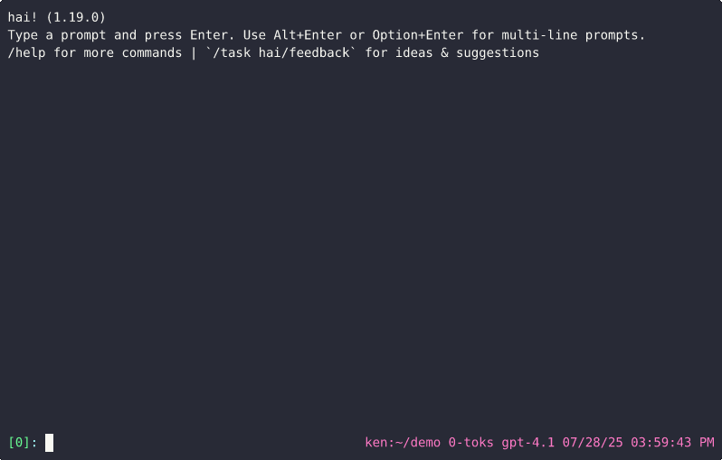

### Load image

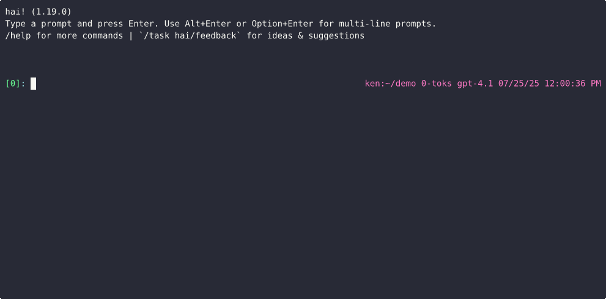

### Load URL

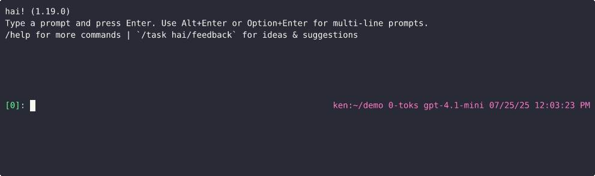

### Using the shell `!sh` tool

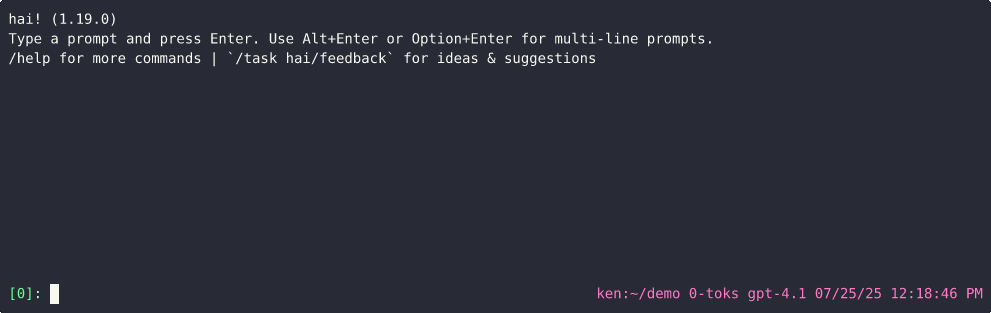

### Using the Python `!py` tool

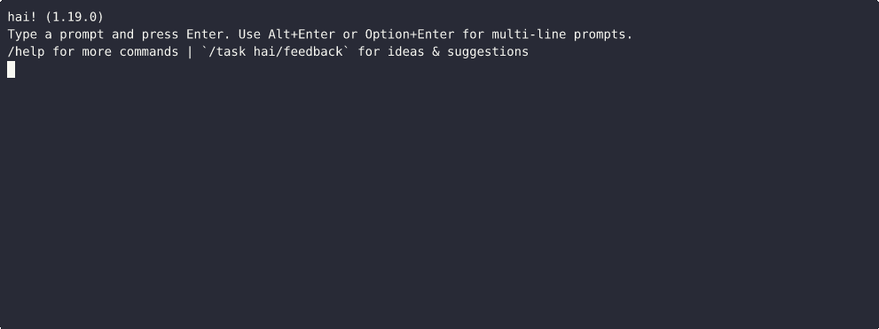

### Using the Python-uv `!pyuv` tool

Like `!py` but delegates to the LLM the responsibility of defining and
installing Python library dependencies.

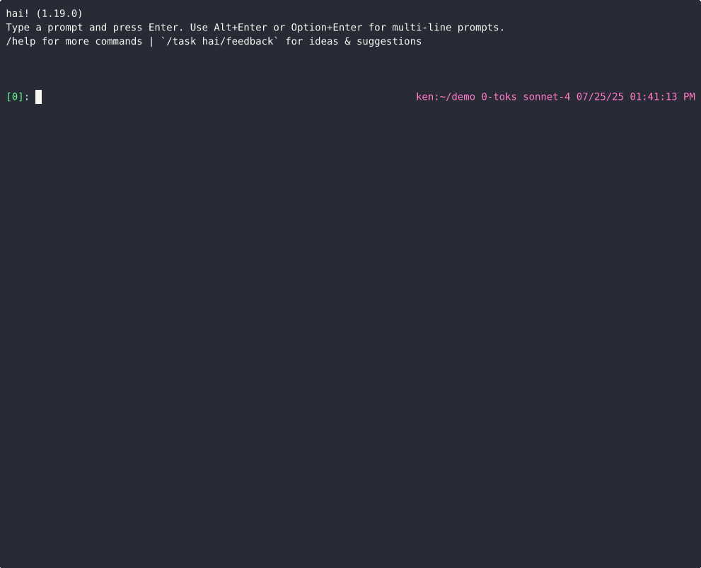

### Using the HTML `!html` tool

<video src="https://github.com/user-attachments/assets/a799a066-3d08-43c3-b190-86e7f0b08735"></video>

### Using the `!hai` tool

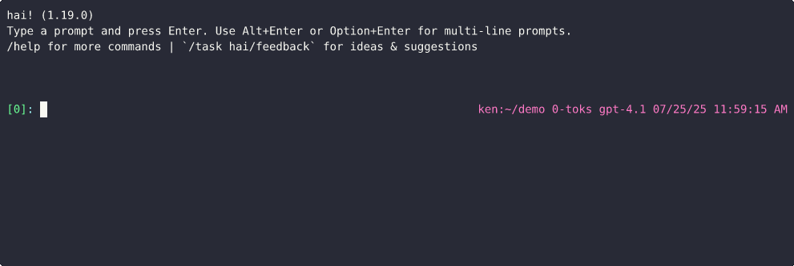

### Using the function tool (Python) `!fn-py`

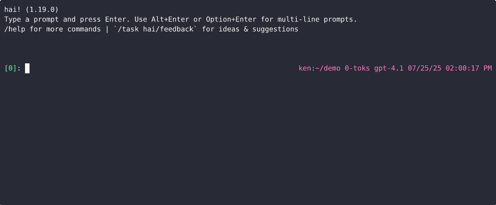

### Using a task

Example uses [`ken/code-review`](https://hai.superego.ai/task/ken/code-review) task.


Example uses [`ken/weather`](https://hai.superego.ai/task/ken/weather) task.

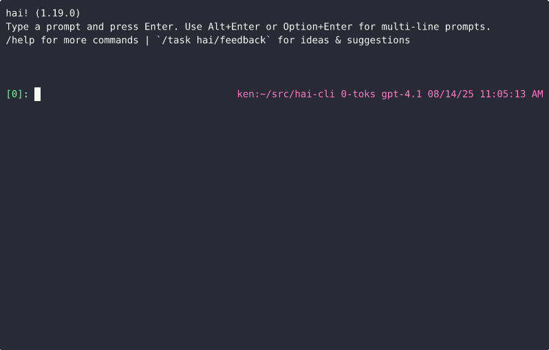

NOTE: Human input and code generation is cached so the next invocation of task
doesn't require the LLM at all.

### Using assets

Assets are a key-value object store in the cloud that you and the LLM can read
or write to. Assets can be shared publicly, monitored for changes, and support
revisions.

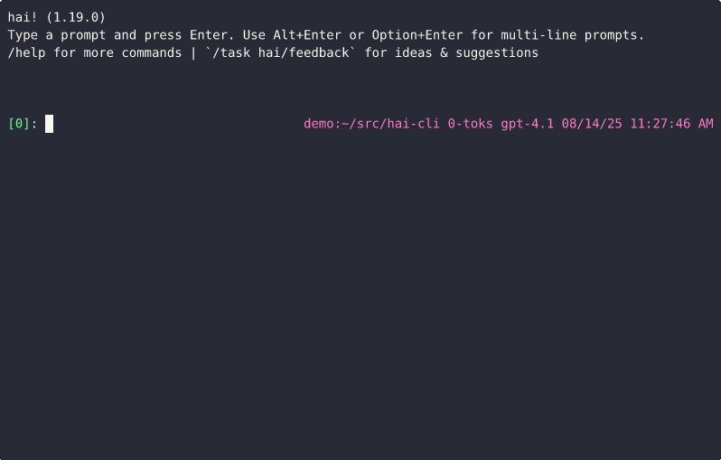

The LLM can use assets without loading them into the conversation:

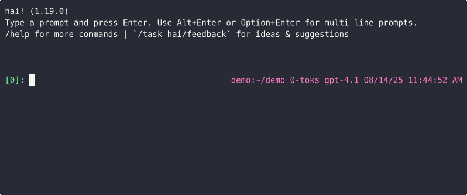

### Multi AI

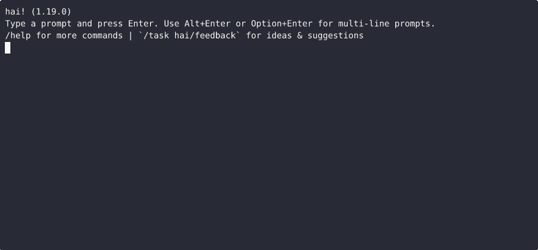

### Send email

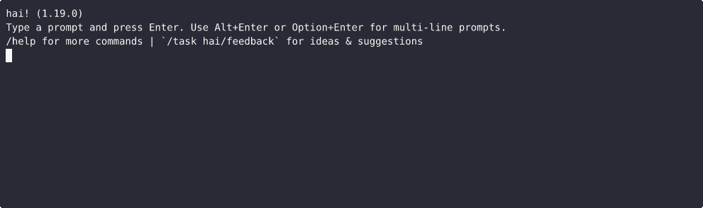

## Video Walkthrough ([YouTube](https://www.youtube.com/watch?v=F6qAy8PF2WU))

[](https://www.youtube.com/watch?v=F6qAy8PF2WU)

### More videos

- [Using hai to manage a personal calendar](https://www.youtube.com/watch?v=vfAnEs_Fpx8)
- [Using hai to get a code review](https://www.youtube.com/watch?v=vuf8FkpVBgo)
- [Using the hai api](https://www.youtube.com/watch?v=WbncAz7yxj0)
- [Using hai to encrypt/decrypt local files as assets](https://www.youtube.com/watch?v=_CA59Fzt-TY)
- [Using hai to analyze YouTube transcripts](https://www.youtube.com/watch?v=hcv6N_mfpaw)
- [Using hai with a search engine](https://www.youtube.com/watch?v=YfSnY-MFrNw)
- [Making the hai walkthrough with ffmpeg](https://www.youtube.com/watch?v=fXd22bR9Vks)
