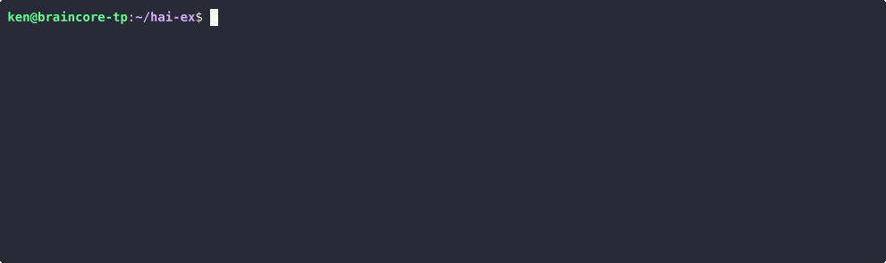

# hai

A REPL for hackers using LLMs.



## Highlights

- ⚡️ Starts in 30ms (on my machine).
- 📦 Single, standalone binary—no installation or dependencies required.
- 🪶 Lightweight (< 9MB compressed) for your machine, SBCs, and servers.
- 🗯 Run many instances for simultaneous conversations.
- 🤖 Supports AIs from OpenAI, Anthropic, DeepSeek, Google, xAI, and Ollama
  (local) all in a single conversation.
- 🕶 Go incognito `hai -i`.
- ⚙ Give AI the power to run programs on your computer.
- 🍝 Share AI prompt-pasta publicly using the task repository.
- 📂 Load images, code, or text into the conversation.
- 🔗 Load URLs with automatic article extraction and markdown conversion.
- 🎨 Highlights syntax for markdown and code snippets.
- 🖼 Render output to browser.
- 💾 Auto-saves last conversation for easy resumption.
- ☁ Store and share data on the cloud for easy access by AIs.
- 📧 Get emails from AI—send notifications or share data.
- 🛠 Open source: Apache License 2.0
- 💻 Supports Linux and macOS. Windows needs testing (help!).

## Video Walkthrough ([YouTube](https://www.youtube.com/watch?v=F6qAy8PF2WU))

[](https://www.youtube.com/watch?v=F6qAy8PF2WU)

### More videos

- [Using hai to manage a personal calendar](https://www.youtube.com/watch?v=vfAnEs_Fpx8)
- [Using hai to get a code review](https://www.youtube.com/watch?v=vuf8FkpVBgo)
- [Using the hai api](https://www.youtube.com/watch?v=WbncAz7yxj0)
- [Using hai to encrypt/decrypt local files as assets](https://www.youtube.com/watch?v=_CA59Fzt-TY)
- [Using hai to analyze YouTube transcripts](https://www.youtube.com/watch?v=hcv6N_mfpaw)
- [Using hai with a search engine](https://www.youtube.com/watch?v=YfSnY-MFrNw)
- [Making the hai walkthrough with ffmpeg](https://www.youtube.com/watch?v=fXd22bR9Vks)

## Quickstart

```console
$ curl -LsSf https://hai.superego.ai/hai-installer.sh | sh
```

!!! tip "Other install methods"
    If you're using Windows or require another method for installation, see
    our installation section.
