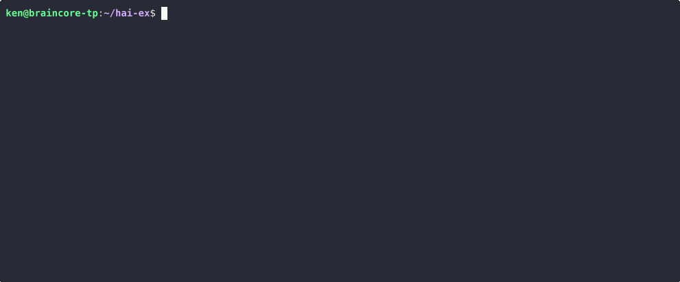

# LLM models

`hai` supports models from OpenAI, Anthropic, DeepSeek, Google, xAI, and
Ollama.



## Default model

The default model is the active model when a new instance of `hai` is launched.

Select a default model with:

```
/ai-default <model>
```

Alternatively, it can be specified in `~/.hai/hai.toml`:

```toml
default_ai_model = "gpt-4.1"
```

If a default model isn't set, it's automatically chosen based on the API keys
you have specified.

## Switching models

Switching is as easy as:

```
/ai <model>
```

Models can even be switched mid-conversation as long as the target model
supports all the capabilities (images, tools) utilized in the conversation.

## Notable models

| Provider   | Notable Models (Not Comprehensive)      |
|------------|-----------------------------------------|
| OpenAI     | gpt-4.1 (`41`), gpt-4.1-mini (`41m`), gpt-4.1-nano (`41n`), chatgpt-4o, gpt-4o (`4o`), gpt-4o-mini (`4om`) |
|            | o4-mini (`o4m`), o3, o3-mini (`o3m`), o1, o1-mini (`o1m`) |
| Anthropic  | sonnet-4 (`sonnet`), sonnet-4-thinking (`sonnet-thinking`), opus-4 (`opus`), opus-4-thinking (`opus-thinking`), haiku-3.5 (`haiku`) |
| Google     | gemini-2.5-flash (`flash25`), gemini-2.5-pro (`gemini25pro`), gemini-2.0-flash (`flash20`) |
| DeepSeek   | deepseek-reasoner (`r1`), deepseek-chat (`v3`) |
| xAI        | grok-4                                         |
| Ollama     | gemma3, llama3.2, llama3.3                     |

If a model doesn’t have a built-in shortcut, or if you want to use a specific
version, you can specify it as `<ai_provider>/<official_model_name>`.
