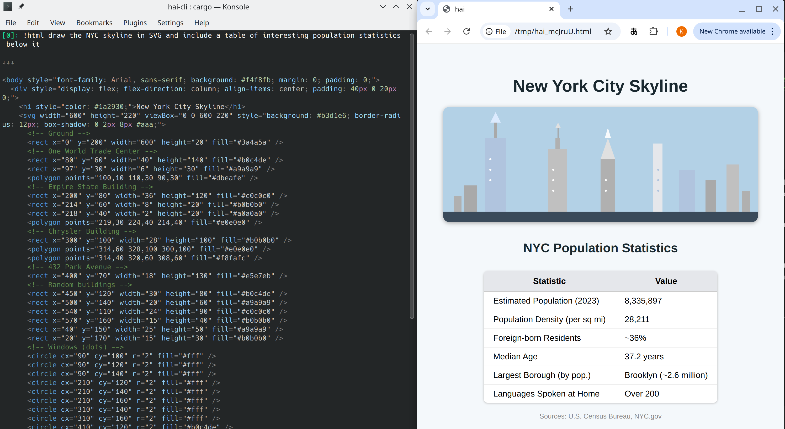

# Tools

Tools let the AI do more than just respond with a message.


## Shell tool `!sh`

`!sh <prompt>` - Ask the AI to execute shell commands directly.

The shell tool prompts the AI to generate a shell script to be executed on your
machine. Both the code and the output is added to the conversation history.

```
[0]: !sh list my home dir
```

```
↓↓↓

ls -lh ~

⚙ ⚙ ⚙

Desktop
Documents
...
```

## Require confirmation `!?`

If you're worried about destructive side effects, you can require your final
confirmation with `!?sh`.

```
[0]: !?sh delete evidence.txt
```

```
↓↓↓

rm evidence.txt

⚙ ⚙ ⚙

[QUESTION] Execute? y/[n]:
```

## Make tool optional `?`

To let the AI to decide whether to use your suggested tool, add a "?" as a
suffix to the tool’s name.

```
[0]: !sh? how old is the earth?
```

```
The Earth is approximately 4.54 billion years old.
```

Note that the answer was given without invoking the shell tool.

## Repeat `!`

Sometimes simply asking the AI the same prompt over again helps it work through
errors it may have encountered in script or code writing. A lone `!` in the
REPL is a shortcut to do this. Note that the previous invocation and error is
now in the conversation history which guides the AI to improve its answer.

```
[0]: !sh what's the weather in santa clara, ca
```
```
↓↓↓

curl -s 'wttr.in/Santa+Clara,CA?format=%C+%t'

⚙ ⚙ ⚙

Unknown location; please try ~37.2333253,-121.6846349
```
```
[3]: !
```
```
↓↓↓

curl -s 'wttr.in/Santa+Clara?format=%C+%t'

⚙ ⚙ ⚙

Partly cloudy +51°F
```

## Same tool, different prompt `! <prompt>`

If you need to change your prompt while using the same tool, use `! <prompt>`
(note that `sh` is omitted). Following from the above weather example:

```
[6]: ! how about tokyo?
```
```
↓↓↓

curl -s 'wttr.in/Tokyo?format=%C+%t'

⚙ ⚙ ⚙

Clear +59°F
```

## Tool mode

If you find yourself using the same tool over-and-over, you can enter tool-mode
by specifying a tool without a prompt (e.g. `!sh`).

```
[0]: !sh
```
```
Entering tool mode; All messages are treated as prompts for !sh. Use `!exit` when done
```

!!!tip "Tool mode in tasks"
    When publishing tasks, you can place users directly into tool-mode by
    making it the final command in your task's list of steps. This approach is
    helpful when your task relies on a tool to respond to user requests. If
    your task requires tool use and regular text responses, consider using the
    optional suffix for the tool mode (e.g. `!sh?`).

## Python Tool `!py` `!pyuv`

`!py` prompts the AI to write a Python script and executes it with your system
Python or your virtual env if available. It may use dependencies that you do
not have installed: you can either install them, try repeat `!` to see if the
AI can work around it, or use `!pyuv` described below.

`!pyuv` prompts the AI to write Python with
[script dependencies](https://docs.astral.sh/uv/guides/scripts/#declaring-script-dependencies)
so that dependencies can be automatically installed. It requires
[`uv`](https://github.com/astral-sh/uv).

Here's an example of it in action:

```
[0]: !pyuv distance from sf to nyc
```

```python
↓↓↓

# /// script
# dependencies = ["geopy"]
# ///
from geopy.distance import geodesic

# Coordinates: (lat, lon)
sf = (37.7749, -122.4194)
nyc = (40.7128, -74.0060)

distance_km = geodesic(sf, nyc).kilometers
distance_miles = geodesic(sf, nyc).miles

print(f"Distance from San Francisco to New York City: {distance_km:.2f} km ({distance_miles:.2f} miles)")

⚙ ⚙ ⚙

Distance from San Francisco to New York City: 4139.15 km (2571.95 miles)
```

## Custom program tool `!'<cmd>'`

You can prompt the AI to generate the `stdin` to any program. For example, to
use `psql`:

```
[0]: !'psql -U postgres -d my_db' what db users are there?
```
```
↓↓↓

SELECT usename FROM pg_user;

⚙ ⚙ ⚙

 usename
---------
postgres
...
```

A `{file}` placeholder can be used to prompt the AI to generate an input file
rather than `stdin`. The below example demonstrates the difference using `uv`.

```
# Uses stdin (-)
[0]: !'uv run --with geopy -' distance from sf to nyc

OR

# Uses temporary file
[0]: !'uv run --with geopy {file.py}' distance from sf to nyc
```

```python
↓↓↓

from geopy.distance import geodesic

sf_coords = (37.7749, -122.4194)  # San Francisco coordinates
nyc_coords = (40.7128, -74.0060)   # New York City coordinates

distance = geodesic(sf_coords, nyc_coords).miles
print(distance)

⚙ ⚙ ⚙

2571.9457567914133
```

Note that a file extension was specified (e.g. `{file.<ext>}`) to force the
temporary file to have a particular extension and enable syntax highlighting.
This is helpful for programs that require input to have a specific extension
(`uv` happens to be one of them, requiring `.py`).

!!!tip
    Note that `uv` is used for demonstrative purposes only and `!pyuv` would
    be the recommended tool for using `uv`.

## HTML tool `!html`

> Even a terminal jockey needs to touch grass every now and then.

To prompt the AI to help you visualize output, you can ask for HTML output that
will be opened by your configured system-default browser. Asking for iterations
using the `!html` tool will trigger reloads automatically.



## Clipboard tool `!clip`

Are you a caveman reaching over to your mouse to copy-and-paste from the
terminal? Use `!clip` to ask the AI to copy-and-paste whatever your need.

## hai tool `!hai`

The LLM knows how to use the REPL.

```
[7]: !hai load silk road wiki. who was the founder?
```
```
↓↓↓

- /load-url https://en.wikipedia.org/wiki/Silk_Road_(marketplace)
- /prompt Who was the founder of the Silk Road marketplace?

⚙ ⚙ ⚙

Pushed 2 command(s) into queue
```
```
!hai-tool[0]: /load-url https://en.wikipedia.org/wiki/Silk_Road_(marketplace)
```
```
Loaded (markdown): Silk Road (marketplace) (32,696 tokens)
```
```
!hai-tool[1]: /prompt Who was the founder of the Silk Road marketplace?
```

```
↓↓↓

The founder of the Silk Road marketplace was **Ross Ulbricht**, who operated under the pseudonym "Dread Pirate Roberts."
```

The AI is capable enough to know what URL to load and then ask itself a
question about the contents.

### !hai recursion

Some LLMs (`sonnet-3.7` is most reliable) are able to work out whether they
need to re-prompt themselves to act on intermediate information.

In this example, only the first command is prompted by the user. The rest,
prefixed by `hai-tool[ ]:`, are prompted by the AI. For brevity, user
confirmations are omitted.

```
[0]: !hai get a random number. if it is even, ask the AI how large the sun is. if it is odd, delete `file1.txt`.
```
```
↓↓↓

- !py Generate a random number and determine if it's even or odd
- !hai Based on the random number generated, if it's even, ask how large the sun is. If it's odd, delete file1.txt
```

```
⚙ ⚙ ⚙

Pushed 2 command(s) into queue
```

```
hai-tool[3]: !py Generate a random number and determine if it's even or odd
```
```
↓↓↓

import random

# Generate a random number between 1 and 100
random_number = random.randint(1, 100)

# Check if the number is even or odd
if random_number % 2 == 0:
    result = "even"
else:
    result = "odd"

print(f"The random number is: {random_number}")
print(f"The number is {result}")
```
```
⚙ ⚙ ⚙

The random number is: 86
The number is even
```

```
hai-tool[6]: !hai Based on the random number generated, if it's even, ask how large the sun is. If it's odd, delete file1.txt
```
```
↓↓↓

- /prompt How large is the sun? Please provide information about its diameter, volume, and mass compared to Earth.
```
```
⚙ ⚙ ⚙

Pushed 1 command(s) into queue
```

```
hai-tool[9]: /prompt How large is the sun? Please provide information about its diameter, volume, and mass compared to Earth.
```
```
↓↓↓

# The Size of the Sun

The Sun is enormously large compared to Earth. Here are the key measurements:

- Sun's diameter: approximately 1.39 million kilometers (864,000 miles)
- Sun's volume: approximately 1.41 × 10^18 cubic kilometers
- Sun's mass: approximately 1.989 × 10^30 kilograms
```

## Function tool `!fn-*`

A drawback of `!py` and `!sh` is that there's no ability to re-use the code
that was written. The LLM writes code every time the tool is invoked, which can
consume a lot of output tokens and the time it takes to generate them.

For example, computing the square root of pi:

```
[0] !py sqrt pi
```

```
↓↓↓

import math
print(math.sqrt(math.pi))
```

```
⚙ ⚙ ⚙

1.7724538509055159
```

A second request to compute the square root of *e* requires the code to be
rewritten:

```
[3] !py sqrt e
```

```
↓↓↓

import math
print(math.sqrt(math.e))
```

```
⚙ ⚙ ⚙

1.6487212707001282
```

The solution is to use `!fn-py <prompt>` which instructs the AI to generate a
Python function that takes an argument and prints the result to add it to the
conversation.

```
[0]: !fn-py find the sqrt, print the result
```
```
↓↓↓

def f(arg):
    import math
    result = math.sqrt(arg)
    print(result)
```

```
⚙ ⚙ ⚙

Stored as command: /f0
```

The new function can be invoked like a command: `/f0 <arg>` without prompting
the LLM. For example:

```
[3]: /f0 64
8.0
```

The LLM can invoke `/f0` when you use the `!hai` tool:

```
[5]: !hai what's the sqrt of pi
```

```
↓↓↓

- /f0 3.141592653589793
```

```
⚙ ⚙ ⚙

Pushed 1 command(s) into queue
```
```
!hai-tool[0]: /f0 3.141592653589793
```
```
1.7724538509055159
```

For a reusable shell function, use `!fn-sh`. For a resuable Python function
that can declare script dependencies, use `!fn-pyuv`.

### Use native expressions as function args

For `!fn-py` and `!fn-pyuv`, the arg can be any Python expression.

```
[0]: !fn-py distance from san francisco. input is tuple of geo coordinates. print result.
```
```
↓↓↓

def f(arg):
    # arg is a tuple of (latitude, longitude)
    from math import radians, sin, cos, sqrt, atan2
    # San Francisco coordinates
    sf_lat, sf_lon = 37.7749, -122.4194
    lat1, lon1 = sf_lat, sf_lon
    lat2, lon2 = arg
    # Radius of the Earth in kilometers
    R = 6371.0
    # Convert degrees to radians
    dlat = radians(lat2 - lat1)
    dlon = radians(lon2 - lon1)
    a = sin(dlat / 2)**2 + cos(radians(lat1)) * cos(radians(lat2)) * sin(dlon / 2)**2
    c = 2 * atan2(sqrt(a), sqrt(1 - a))
    distance = R * c
    print(f"Distance from San Francisco, CA to {arg}: {distance:.2f} km")
```
```
⚙ ⚙ ⚙

Stored as command: /f0
```

Using a Python tuple as the arg:

```
[3]: /f0 (0.0, 78.5)
```

```
Distance from San Francisco, CA to (0.0, 78.5): 15299.16 km
```

Similarly, `!fn-sh` accepts a shell expression.

### Named functions

Use the `name` option to give a function a proper name:

```
[0] !fn-py(name="sqrt") find the sqrt
```

```
↓↓↓

def f(arg):
    import math
    return math.sqrt(arg)
```
```
⚙ ⚙ ⚙

Stored as command: /f_sqrt
```
