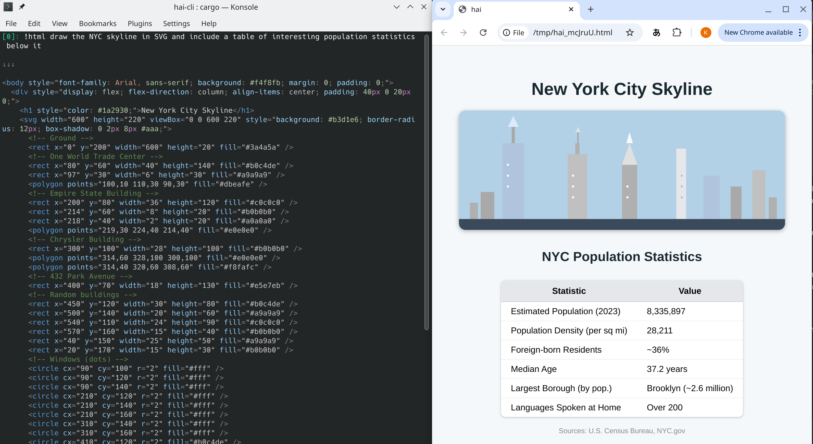

# Tools

Tools let the AI do more than just respond with a message.


## Toolbox

To make tools available to the AI, add them to your toolbox using `!<tool>`.
For example:

```
[0]: !sh
Adding !sh to toolbox. Use `!-sh` or `!clear` to remove.
```

Later prompts will show the available tool:

```
[2] !sh: <prompt>
```

Multiple tools can be added:

```
[2] !sh: !py
Adding !py to toolbox. Use `!-py` or `!clear` to remove.
[4] !sh,py:
```

## Shell tool `!sh`

`!sh` - Ask the AI to execute shell commands directly.

The shell tool prompts the AI to generate a shell script to be executed on your
machine. Both the code and the output is added to the conversation history.

```
[0] !sh: list my home dir
```

```
↓↓↓

ls -lh ~

⚙ ⚙ ⚙

Desktop
Documents
...
```

## Require confirmation `!?`

If you're worried about destructive side effects, you can require your final
confirmation with `!?<tool>`.

```
[0]: !?sh
Adding !?sh to toolbox. Use `!-sh` or `!clear` to remove.
[2]: delete evidence.txt
```

```
↓↓↓

rm evidence.txt

⚙ ⚙ ⚙

[QUESTION] Execute? y/[n]:
```

## Force tool use

By default, the AI is free to decide whether to use any tool, and if so, which
one.

To force the AI to use a specific tool, use the one-liner `!<tool> <prompt>`:

```
[0]: !py add 11 + 31
```

After using the tool, the tool will be added to the toolbox. To use the tool
just one time without adding it to the toolbox, use `!-<tool>`:

```
[0]: !-py add 11 + 31
```

This works regardless of what tools are already in the toolbox:

```
[0] !sh,py: !py add 11 + 31
```

## Python Tool `!py` `!pyuv`

`!py` prompts the AI to write a Python script and execute it with your system
Python or virtual env (`.venv`) if available in the current working directory.
It may use dependencies that you do not have installed: you can either install
them, pester the AI to try again to see if it can work around it, or use
`!pyuv` described below.

`!pyuv` prompts the AI to write Python with
[script dependencies](https://docs.astral.sh/uv/guides/scripts/#declaring-script-dependencies)
so that dependencies can be automatically installed. It requires
[`uv`](https://github.com/astral-sh/uv).

Here's an example of it in action:

```
[0]: !pyuv distance from sf to nyc
```

```python
↓↓↓

# /// script
# dependencies = ["geopy"]
# ///
from geopy.distance import geodesic

# Coordinates: (lat, lon)
sf = (37.7749, -122.4194)
nyc = (40.7128, -74.0060)

distance_km = geodesic(sf, nyc).kilometers
distance_miles = geodesic(sf, nyc).miles

print(f"Distance from San Francisco to New York City: {distance_km:.2f} km ({distance_miles:.2f} miles)")

⚙ ⚙ ⚙

Distance from San Francisco to New York City: 4139.15 km (2571.95 miles)
```

## Custom program tool `!'<cmd>'`

You can prompt the AI to generate the `stdin` to any program. For example, to
use `psql`:

```
[0]: !'psql -U postgres -d my_db' what db users are there?
```
```
↓↓↓

SELECT usename FROM pg_user;

⚙ ⚙ ⚙

 usename
---------
postgres
...
```

A `{file}` placeholder can be used to prompt the AI to generate an input file
rather than `stdin`. The below example demonstrates the difference using `uv`.

```
# Uses stdin (-)
[0]: !'uv run --with geopy -' distance from sf to nyc

OR

# Uses temporary file
[0]: !'uv run --with geopy {file.py}' distance from sf to nyc
```

```python
↓↓↓

from geopy.distance import geodesic

sf_coords = (37.7749, -122.4194)  # San Francisco coordinates
nyc_coords = (40.7128, -74.0060)   # New York City coordinates

distance = geodesic(sf_coords, nyc_coords).miles
print(distance)

⚙ ⚙ ⚙

2571.9457567914133
```

Note that a file extension was specified (e.g. `{file.<ext>}`) to force the
temporary file to have a particular extension and enable syntax highlighting.
This is helpful for programs that require input to have a specific extension
(`uv` happens to be one of them, requiring `.py`).

!!!tip
    Note that `uv` is used for demonstrative purposes only and `!pyuv` would
    be the recommended tool for using `uv`.

## HTML tool `!html`

> Even a terminal jockey needs to touch grass every now and then.

To prompt the AI to help you visualize output, you can ask for HTML output that
will be opened by your configured system-default browser. Asking for iterations
using the `!html` tool will trigger reloads automatically.



## Clipboard tool `!clip`

Are you a caveman reaching over to your mouse to copy-and-paste from the
terminal? Use `!clip` to ask the AI to copy-and-paste whatever your need.
For example:

```
!clip option #3
```

## hai tool `!hai`

The LLM knows how to use the REPL.

```
[7]: !hai load silk road wiki. who was the founder?
```
```
↓↓↓

- /http-get https://en.wikipedia.org/wiki/Silk_Road_(marketplace)
- /prompt Who was the founder of the Silk Road marketplace?

⚙ ⚙ ⚙

Pushed 2 command(s) into queue
```
```
!hai-tool[0]: /load-url https://en.wikipedia.org/wiki/Silk_Road_(marketplace)
```
```
Loaded (markdown): Silk Road (marketplace) (32,696 tokens)
```
```
!hai-tool[1]: /prompt Who was the founder of the Silk Road marketplace?
```

```
↓↓↓

The founder of the Silk Road marketplace was **Ross Ulbricht**, who operated under the pseudonym "Dread Pirate Roberts."
```

The AI is capable enough to know what URL to load and then ask itself a
question about the contents.

## Agentic mode

> Let the LLM cook.

Agentic mode allows the LLM to loop autonomously, executing tools and analyzing
results until it decides the task is complete.

```
/agentic on
```

When enabled, a 🤖 emoji appears in your prompt.

The ability of agentic mode to produce quality results depends greatly on the
model. You should experiment with various models, but the `opus` model family
is a good starting point (`opus-4.5` minimum).

### How it works

Agentic mode gives LLMs the option to loop when invoking a tool such as `!sh`
or `!hai`.

### Prompt caching with Anthropic API

Due to the iterative, back-and-forth nature of agentic mode, prompt caching is
explicitly turned on when used with Anthropic's API. This increases input token
costs by 1.25x when novel, but saves 90% of input token costs when cached.

To disable prompt caching, use:

```
/agentic on-without-cache
```

This is not relevant to OpenAI since their API always caches and does not have
additional costs.

## Function tool `!fn-*`

A drawback of `!py` and `!sh` is that there's no ability to re-use the code
that was written. The LLM writes code every time the tool is invoked, which can
consume a lot of output tokens and the time it takes to generate them.

For example, computing the square root of pi:

```
[0] !py sqrt pi
```

```
↓↓↓

import math
print(math.sqrt(math.pi))
```

```
⚙ ⚙ ⚙

1.7724538509055159
```

A second request to compute the square root of *e* requires the code to be
rewritten:

```
[3] !py sqrt e
```

```
↓↓↓

import math
print(math.sqrt(math.e))
```

```
⚙ ⚙ ⚙

1.6487212707001282
```

The solution is to use `!fn-py <prompt>` which instructs the AI to generate a
Python function that takes an argument and prints the result to add it to the
conversation.

```
[0]: !fn-py find the sqrt, print the result
```
```
↓↓↓

def f(arg):
    import math
    result = math.sqrt(arg)
    print(result)
```

```
⚙ ⚙ ⚙

Stored as command: /f0
```

The new function can be invoked like a command: `/f0 <arg>` without prompting
the LLM. For example:

```
[3]: /f0 64
8.0
```

The LLM can invoke `/f0` when you use the `!hai` tool:

```
[5]: !hai what's the sqrt of pi
```

```
↓↓↓

- /f0 3.141592653589793
```

```
⚙ ⚙ ⚙

Pushed 1 command(s) into queue
```
```
!hai-tool[0]: /f0 3.141592653589793
```
```
1.7724538509055159
```

For a reusable shell function, use `!fn-sh`. For a resuable Python function
that can declare script dependencies, use `!fn-pyuv`.

### Use native expressions as function args

For `!fn-py` and `!fn-pyuv`, the arg can be any Python expression.

```
[0]: !fn-py distance from san francisco. input is tuple of geo coordinates. print result.
```
```
↓↓↓

def f(arg):
    # arg is a tuple of (latitude, longitude)
    from math import radians, sin, cos, sqrt, atan2
    # San Francisco coordinates
    sf_lat, sf_lon = 37.7749, -122.4194
    lat1, lon1 = sf_lat, sf_lon
    lat2, lon2 = arg
    # Radius of the Earth in kilometers
    R = 6371.0
    # Convert degrees to radians
    dlat = radians(lat2 - lat1)
    dlon = radians(lon2 - lon1)
    a = sin(dlat / 2)**2 + cos(radians(lat1)) * cos(radians(lat2)) * sin(dlon / 2)**2
    c = 2 * atan2(sqrt(a), sqrt(1 - a))
    distance = R * c
    print(f"Distance from San Francisco, CA to {arg}: {distance:.2f} km")
```
```
⚙ ⚙ ⚙

Stored as command: /f0
```

Using a Python tuple as the arg:

```
[3]: /f0 (0.0, 78.5)
```

```
Distance from San Francisco, CA to (0.0, 78.5): 15299.16 km
```

Similarly, `!fn-sh` accepts a shell expression.

### Named functions

Use the `name` option to give a function a proper name:

```
[0] !fn-py(name="sqrt") find the sqrt
```

```
↓↓↓

def f(arg):
    import math
    return math.sqrt(arg)
```
```
⚙ ⚙ ⚙

Stored as command: /f_sqrt
```

### Show all functions

To see all functions declared in the current conversation, use:

```
/fns
```

## !hai recursion

> [Agentic mode](#agentic-mode) is the preferred way to achieve recursion. This
> section remains for pre-agentic historical purposes.

Some LLMs (`sonnet-3.7` is most reliable) are able to work out whether they
need to re-prompt themselves to act on intermediate information.

In this example, only the first command is prompted by the user. The rest,
prefixed by `hai-tool[ ]:`, are prompted by the AI. For brevity, user
confirmations are omitted.

```
[0]: !hai get a random number. if it is even, ask the AI how large the sun is. if it is odd, delete `file1.txt`.
```
```
↓↓↓

- !py Generate a random number and determine if it's even or odd
- !hai Based on the random number generated, if it's even, ask how large the sun is. If it's odd, delete file1.txt
```

```
⚙ ⚙ ⚙

Pushed 2 command(s) into queue
```

```
hai-tool[3]: !py Generate a random number and determine if it's even or odd
```
```
↓↓↓

import random

# Generate a random number between 1 and 100
random_number = random.randint(1, 100)

# Check if the number is even or odd
if random_number % 2 == 0:
    result = "even"
else:
    result = "odd"

print(f"The random number is: {random_number}")
print(f"The number is {result}")
```
```
⚙ ⚙ ⚙

The random number is: 86
The number is even
```

```
hai-tool[6]: !hai Based on the random number generated, if it's even, ask how large the sun is. If it's odd, delete file1.txt
```
```
↓↓↓

- /prompt How large is the sun? Please provide information about its diameter, volume, and mass compared to Earth.
```
```
⚙ ⚙ ⚙

Pushed 1 command(s) into queue
```

```
hai-tool[9]: /prompt How large is the sun? Please provide information about its diameter, volume, and mass compared to Earth.
```
```
↓↓↓

# The Size of the Sun

The Sun is enormously large compared to Earth. Here are the key measurements:

- Sun's diameter: approximately 1.39 million kilometers (864,000 miles)
- Sun's volume: approximately 1.41 × 10^18 cubic kilometers
- Sun's mass: approximately 1.989 × 10^30 kilograms
```
